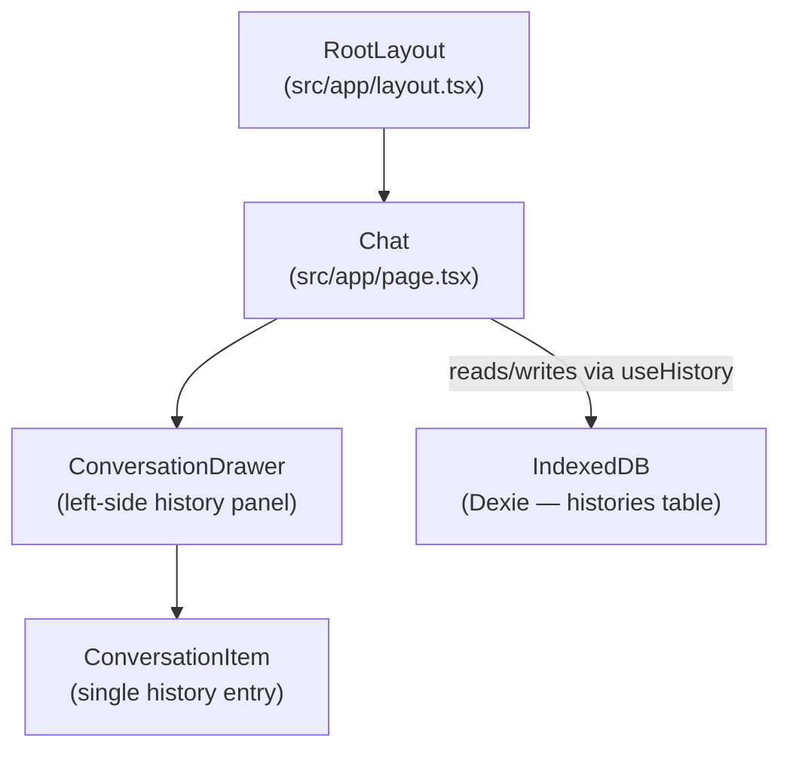
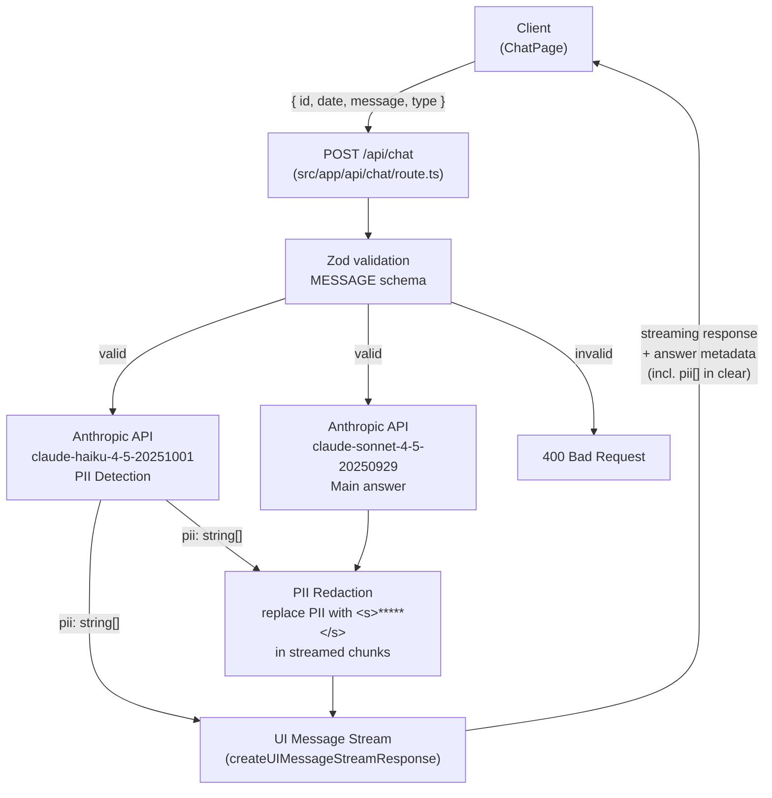

# Architecture

## FRONTEND

### Pages

| Route | File               | Description                                                                                                     |
| ----- | ------------------ | --------------------------------------------------------------------------------------------------------------- |
| `/`   | `src/app/page.tsx` | Chat interface — send messages, display streaming responses, persist and browse conversation history via drawer |

---

## BACKEND

### Endpoints

| Method | Path        | Description                                                                                                                                                                              |
| ------ | ----------- | ---------------------------------------------------------------------------------------------------------------------------------------------------------------------------------------- |
| `POST` | `/api/chat` | Validates body with Zod (`MESSAGE` schema), runs PII detection via Haiku, streams a redacted text response from Sonnet with answer metadata (including detected PII values in clear) |

### External Providers

| Provider  | SDK                 | Model                        | Role                                      |
| --------- | ------------------- | ---------------------------- | ----------------------------------------- |
| Anthropic | `@ai-sdk/anthropic` | `claude-haiku-4-5-20251001`  | PII detection (pre-processing, blocking)  |
| Anthropic | `@ai-sdk/anthropic` | `claude-sonnet-4-5-20250929` | Main answer (streamed, PII-redacted)      |
