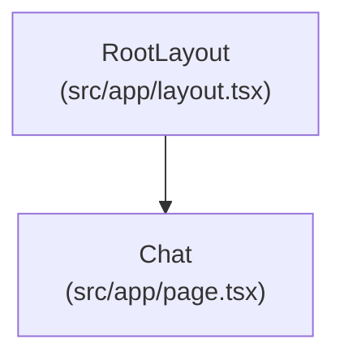
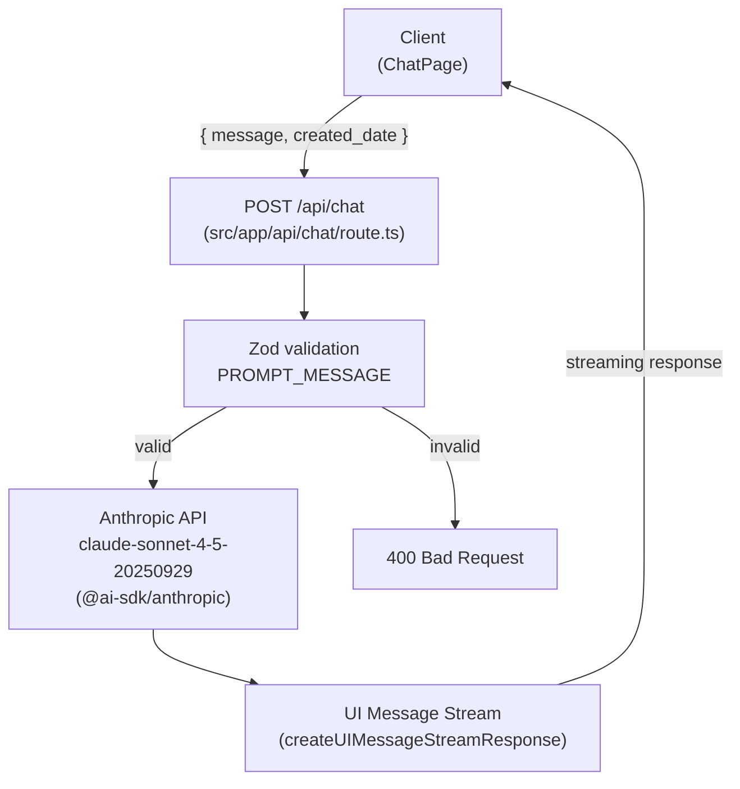

# Architecture

## FRONTEND

### Pages

| Route | File               | Description                                                                       |
| ----- | ------------------ | --------------------------------------------------------------------------------- |
| `/`   | `src/app/page.tsx` | Chat interface — send messages, display conversation history, streaming responses |

---

## BACKEND

### Endpoints

| Method | Path        | Description                                                     |
| ------ | ----------- | --------------------------------------------------------------- |
| `POST` | `/api/chat` | Validates body with Zod, streams a text response from Anthropic |

### External Providers

| Provider  | SDK                 | Model                        |
| --------- | ------------------- | ---------------------------- |
| Anthropic | `@ai-sdk/anthropic` | `claude-sonnet-4-5-20250929` |
